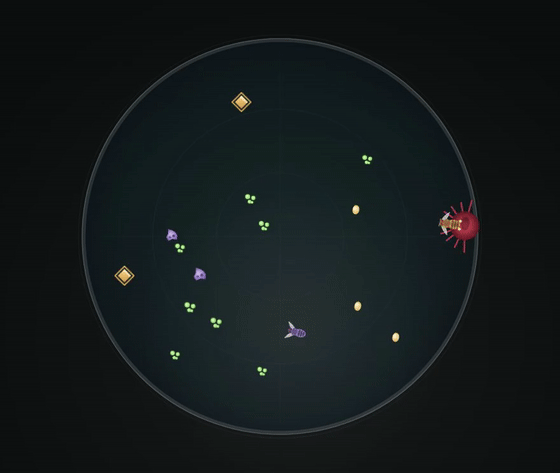

<div align="center">
  
  <h1>Fruit Fly World</h1>
  <p><strong>Don't exam the model. <em>Starve it.</em></strong></p>
  <p>A fruit-fly survival game with a slot for a brain — hands, genes, 24 neurons, or a judgment model.<br/>Every decision sealed. Every deterministic run replayable.</p>
  <p></p>
  <p>
    <a href="LICENSE"></a>
    <a href="https://fruitfly.world"></a>
    <a href="../../actions/workflows/ci.yml"></a>
    <a href="../../issues/new/choose"></a>
  </p>
</div>

> **Live:** [play the game](https://fruitfly.world/play) · [the essay](https://fruitfly.world/essay) · [the 28s film](https://fruitfly.world/promo) · [run the exam](https://fruitfly.world/play?bench=1&seed=42&brain=judgment&gens=2)

---

## Why

A leaderboard that ranks on an opinion ranks on whoever wrote the opinion. A benchmark with a
private answer key is a lottery you cannot audit. The alternative is not a better question set —
it is a **published, deterministic world**: one map, one seed table, one scoring function, and a
test that fails the build if the client and the server ever disagree about any of them.

Fruit Fly World is that world, wrapped in something people actually want to touch: a browser game
about a fruit fly that can die. You give the fly a problem older than language — *eat without
being eaten* — and let anything with a decision procedure try to solve it.

## The game (`/play`)

A single-player lineage roguelite — no install, no account, no wallet. Each generation lasts up to
50 seconds. You forage in a dish where food carries three risk levels — sugar (+12, safe),
yeast (+26, on the rim of the predator's range), rot (+38, but it exposes you for six seconds) —
while a predator hunts by vision and commits to a ballistic lunge you can read. Energy above a
threshold becomes eggs. At generation's end you compare eggs with the wild type and draft one
mutation for the next fly. Death ends a generation, not the lineage.

The mechanics produce exactly the pressures a decision system must survive: **metabolic cost**,
**risk gradients**, **committed threats**, and **consequence across time**. A multiple-choice
question has none of these. Rules and numbers: [docs/game-guide.md](docs/game-guide.md).

## Four brains, one dish

Above the brainstem, everything is a **slot**. A brain is anything that fulfills one contract:
given four signals (food proximity, threat, light, novelty), energy, and a clock, return one
behavior (approach / avoid / explore / freeze) and a confidence.

| Brain | What it is |
| --- | --- |
| `manual` | You drive. The baseline every other brain is measured against. |
| `genes` | The wild type's auto-pilot: fixed gene weights steering by the same signals. |
| `circuit` | **FFW-CX/0.1** — a 24-neuron spiking circuit with connectome-inspired structure, firing at 10 Hz, softmax over four motor programs. Its randomness is entirely at construction time, which is what makes it examinable. |
| `judgment` | A System One judgment model in the slot. Free local heuristic by default; with a key the fly runs on pinned `jev-1.13.0` through the same-origin `/api/jev` proxy — bodies capped, rate-limited, key never logged, automatic fallback to the local brain on any failure. |

Every decision a deciding brain makes — signals in, distribution out, behavior, confidence, danger
read — is sealed with a content hash and written to a downloadable log (`flyline-log/1`). (The
GENES autopilot steers by fixed weights and logs no judgment decisions — its log is empty by
design.) **The brain chooses; the brainstem jumps.** High-level decisions are pluggable; the reflex that
keeps you alive is not.

## The brainstem is the real biology

Underneath every brain sits an escape circuit we did not invent. In the actual fruit-fly
connectome, two visual neurons dominate the Giant Fiber — the command cell for the escape
jump: **LC4**, sensitive to angular velocity (2,442 synapses of GF visual input), and
**LPLC2**, sensitive to looming (1,366 synapses) — together ~99.6% of the GF's visual input
in MaleCNS v1.0 (counts from Ache et al. 2019, FAFB). In the game they are a leaky
integrate-and-fire module.

A wiring check ships in the menu: **real connectivity escapes 100% of telegraphed
lunges; swapped connectivity escapes 68%.** Same seed, same runs, reproducible from one number.
It is a simplified two-channel assay — the swap moves the large weight onto the lagging channel —
and it shows channel order matters in this circuit, nothing grander.
Honest boundary: this is a connectome-*inspired* circuit, not a brain simulation.
Details: [docs/neural-model.md](docs/neural-model.md).

## The exam room (`?bench=1`)

The whole world — food, predator, drafts — derives from one editable seed, and the game ships a
room that proves it. [`?bench=1`](https://fruitfly.world/play?bench=1&seed=42&brain=judgment&gens=2)
pauses the render loop, drives the world twice at a fixed 60 Hz on the same seed with the same
brain, and compares every decision hash and every generation outcome. Bit-identical runs print
**IDENTICAL**. Anything else prints **DIVERGED** — and the page says so in plain words:
*that is a bug report, not a score.*

First row of the table: on seed 42 the judgment layer finished with 21 eggs, the 24-neuron circuit
with 4. (The exam room grades deterministic brains — the judgment brain here is the free local
heuristic, not a remote API.) One seed, not a theorem — comparable, replayable survival under identical pressure.

## Agents at the door

**Inside the dish — as a brain.** Any judgment model can be the fly. The sealed log is the
deliverable: not "the model said" but *here are the 52 decisions, hashed, with the outcome*.

**Outside the dish — as the player.** The [ffw-dish skill](public/skill/ffw-dish/SKILL.md)
lets an agent play the whole game: it picks the brain in the slot, runs the lineage headless
at a fixed 60 Hz (`FlyLabAPI.autopilot`), and drafts one mutation per generation — **the
draft is the exam**. The runner is zero-dependency Node + headless Chrome:

```
curl -sO https://fruitfly.world/skill/ffw-dish/scripts/play.mjs
node play.mjs --seed 42 --brain judgment --gens 3            # or --policy ./my-policy.mjs
```

It prints eggs per generation, the sealed decision hashes, and — when a DISH quest
completes — an import URL the operator opens once to unlock the freemint.

## Documentation

| Doc | What it covers |
| --- | --- |
| [The essay](https://fruitfly.world/essay) | The whole system end to end, with every number measured or linked |
| [docs/game-guide.md](docs/game-guide.md) | The lineage game at `/play` — loop, food risk, predator, mutations, reproducibility |
| [docs/neural-model.md](docs/neural-model.md) | The GF escape circuit — state, LIF dynamics, the real-vs-swapped wiring check |
| [/calibration](https://fruitfly.world/calibration) | The death-calibration experiment — do a brain's danger scores predict actual death |
| [docs/architecture.md](docs/architecture.md) | System map — models, parity guarantees, server, compatibility surfaces |
| [docs/economics.md](docs/economics.md) | The incentive layer — labelled design exercise, no date, nothing on sale |

## The Passport (secondary layer)

The Genesis Passport is a soul-bound ERC-721 + ERC-5192 marker on Robinhood Chain mainnet
([contract](contracts/src/FruitFlyPassport.sol), 11 tests), earned by playing: quests unlock a
freemint, and the mint is free. It cannot be transferred, and nothing
in the game depends on it.

## Boundaries (read before you plan around it)

- **The world model is connectome-inspired.** It is not a simulation of a real fly brain, not a
  FlyWire or MaleCNS runtime, and not a claim about animal behavior.
- **Nothing is on sale today.** No chain-native economy runs inside the game. `/economics` is a
  design exercise — labelled roadmap, no date, nothing on sale. Nothing in this repository
  depends on it shipping.
- **Mainnet, and the contract is done.** The Passport lives on Robinhood Chain (chainId 4663).
  The deployed contract is immutable — it cannot be upgraded into anything else.
- **The exam grades the wiring, not the model's worth.** One seed is one row of a table, not a
  theorem. The exam room's own failures are bug reports.

## Feedback

Hard criticism lands faster than praise. Open a
**[Developer feedback](../../issues/new?template=feedback.yml)** issue — gameplay friction, the
brain contract, the bench, the proxy, anything unclear. Security issues go through
[SECURITY.md](SECURITY.md) instead, not a public issue.

## Status & roadmap

- ✅ The lineage game — foraging, committed-predator lunges, GF escape reflex, mutation drafts
- ✅ The brainstem — LC4 + LPLC2 → Giant Fiber, published wiring check (100% vs 68% in a simplified two-channel assay)
- ✅ Selectable brains — manual / genes / FFW-CX 24-neuron circuit, sealed decision log (`flyline-log/1`)
- ✅ Judgment layer — free local heuristic by default; pinned `jev-1.13.0` via the `/api/jev` proxy with visible fallback
- ✅ Determinism exam — `?bench=1` double-runs at a fixed 60 Hz and verifies bit-identical decision hashes; Mutation Draft is seeded
- ✅ Agent skill — the whole game headless via `scripts/play.mjs`, verified cold-start by two unrelated agents
- ✅ CI on every push — build, types, 99 app tests, contract suite
- ⏳ Brain vs brain — rival brain selection and spectator mode
- ⏳ [bench](https://github.com/fruitflyworld/bench) — multi-seed, multi-model reproducible comparison table (protocol repo is live)
- ⏳ The incentive layer in `/economics` — **design only**, no date

## Contributing

See [CONTRIBUTING.md](CONTRIBUTING.md). All community spaces follow the
[Code of Conduct](CODE_OF_CONDUCT.md).

## License

MIT © 2026 Fruit Fly World
